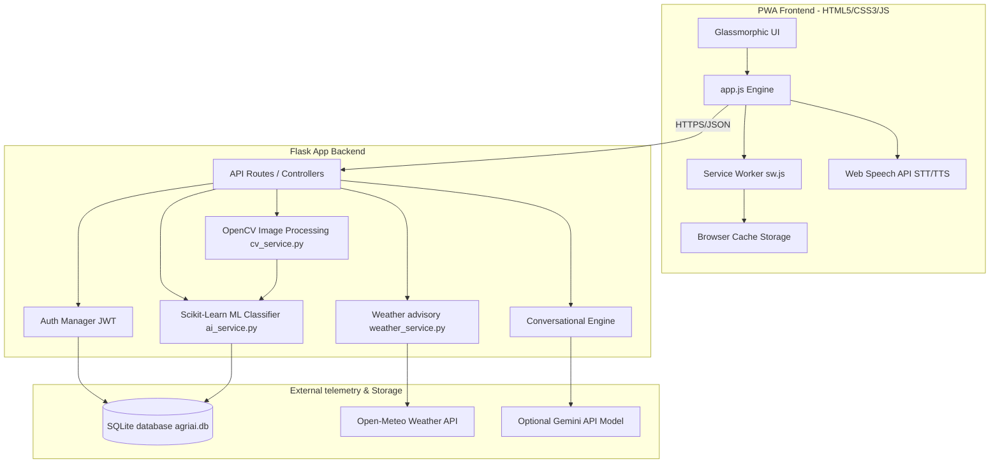

# AgriAI — Production-Level AI Smart Farming Platform

AgriAI is a comprehensive, production-grade AI-powered agricultural digital ecosystem designed for modern farmers, experts, and system administrators. The application provides localized crop leaf disease diagnostics using Computer Vision (OpenCV), customized soil NPK recommendations, moisture-sensitive irrigation planners, weather telemetry integration, a multilingual voice chat assistant, and IoT sensor consoles.

---

## 🏗️ System Architecture Diagram



---

## ⚡ Core Features

1. **AI Crop Disease Scanner**: Snap/upload leaf photos. OpenCV processes contrast, segments leaf contour tissue in HSV space, extracts lesions, and classifies them via Scikit-learn with severity/remedies.
2. **Soil & Fertilizer Advisory**: NPK calculator and health scorer based on growth stage, moisture, and pH.
3. **Smart Irrigation Planner**: Calculates daily drip lines timings and conservation practices based on crop hydrology.
4. **AI Voice Chat Assistant**: Full text/voice conversation in **11 regional languages** (Telugu, Hindi, Tamil, Kannada, Malayalam, Bengali, Marathi, Punjabi, Gujarati, Odia, English) using native Web Speech APIs and offline translation fallbacks.
5. **Weather Telemetry**: Live Open-Meteo forecasting generating crop-dusting safety guidelines.
6. **Government Schemes & Market Prices**: Real-time mandi prices and subsidy applications catalogs.
7. **Drone & IoT ready**: Simulates telemetry maps and soil node arrays.
8. **Admin Panel**: Monitors CPU/memory load and user role configurations.

---

## 📂 Project Directory Structure

```
/
├── backend/
│   ├── app/
│   │   ├── __init__.py          # Flask application factory
│   │   ├── config.py            # Global upload/secret configurations
│   │   ├── models/
│   │   │   └── db.py            # SQLite schema initialization & seeding
│   │   ├── routes/
│   │   │   ├── auth.py          # User authentication blueprints
│   │   │   ├── disease.py       # Upload & OpenCV scanning logic
│   │   │   ├── farming.py       # Weather, NPK, irrigation, prices blueprints
│   │   │   ├── chat.py          # Multilingual conversation routes
│   │   │   └── analytics.py     # Admin statistics aggregator
│   │   ├── services/
│   │   │   ├── cv_service.py    # OpenCV Leaf Denoising & contour highlighting
│   │   │   ├── ai_service.py    # Scikit-learn classifier & chat engine
│   │   │   └── weather_service.py # Weather fetch & advisory generator
│   │   └── controllers/
│   └── run.py                   # Main backend start script
├── frontend/
│   ├── index.html               # Multi-panel landing & dashboard view HTML
│   ├── style.css                # Glassmorphic responsive styling system
│   ├── app.js                   # Client side controller logic & charts
│   ├── sw.js                    # PWA Service Worker caching
│   └── manifest.json            # PWA metadata for home screen install
├── test_cv.py                   # Automated OpenCV/ML integration test
└── README.md                    # Platform documentation
```

---

## 🛠️ Installation & Setup

### Prerequisites
- Python 3.10+
- Modern Web Browser (Chrome / Edge / Safari supporting SpeechRecognition)

### 1. Set Up Environment & Install Dependencies
Navigate to the root workspace directory and install the required libraries:
```bash
pip install Flask Flask-Cors PyJWT opencv-python numpy scikit-learn deep-translator requests
```

### 2. Run Automated Verification Tests
Verify that OpenCV, Scikit-learn, and the database classification services are working properly before launching:
```bash
python test_cv.py
```
*Expected output: `=== TEST COMPLETED SUCCESSFULLY ===`*

### 3. Start the Server
Start the Flask server. It will automatically initialize the database `agriai.db` and host the PWA frontend on port `5000`:
```bash
python backend/run.py
```

### 4. Open the Web Application
Open your web browser and navigate to:
```
http://localhost:5000
```
To test on a mobile device, connect the device to the same Wi-Fi network and open `http://<your-computer-ip>:5000`.

---

## 📡 REST API Documentation

### Authentication Endpoints
- **`POST /api/auth/register`**: Creates a user profile.
  - *Payload*: `{"username": "...", "password": "...", "role": "farmer|expert|admin", "full_name": "..."}`
- **`POST /api/auth/login`**: Returns JWT authentication token.
  - *Payload*: `{"username": "...", "password": "..."}`

### Agricultural Advisory Endpoints
- **`POST /api/disease/scan`**: Accepts multipart/form-data upload. Returns OpenCV contour mappings and disease class.
  - *Params*: `image` (File), `crop` (String)
- **`POST /api/farming/fertilizer`**: Returns NPK advisory.
  - *Payload*: `{"crop": "Tomato", "soil_type": "Loamy", "ph": 6.5, "moisture": 45, "growth_stage": "Vegetative"}`
- **`POST /api/farming/irrigation`**: Returns water schedule.
  - *Payload*: `{"crop": "Tomato", "soil_moisture": 35, "temperature": 32, "water_availability": "Adequate"}`
- **`POST /api/farming/yield`**: Predicts tons/acre yield.
  - *Payload*: `{"crop": "Paddy", "soil_type": "Clayey", "moisture": 60, "disease_history": "none"}`
- **`GET /api/farming/weather`**: Fetches weather telemetry.
  - *Params*: `lat` (Float), `lon` (Float)

### Communication Endpoints
- **`POST /api/chat/message`**: Chats in local languages.
  - *Payload*: `{"message": "...", "language": "te|hi|en|..."}`

---

## 📖 Developer Guide

### Extending OpenCV Image Pipeline
The image segmentation takes place in `cv_service.py`. If you need to add custom feature extractions (e.g. leaf surface area calculation or spot textures):
1. Navigate to `backend/app/services/cv_service.py`.
2. Edit `process_leaf_image()`. You can adjust the HSV ranges for `lower_green` or add masks for specific colorations like powdery mildew (whitish spots).
3. The processed base64 image outputs are automatically written to `backend/uploads/` and served statically.

### Adding New Crops to Scikit-learn Classifier
1. Open `backend/app/services/ai_service.py`.
2. Add your crop keys and disease classes to the `DISEASE_PROFILES` dictionary, including the organic, chemical, and prevention strings.
3. The `train_classifiers()` routine will automatically fit a new Decision Tree model on startup.

---

## 🌾 Farmer User Manual

### 1. Diagnosing a Sick Leaf
- Navigate to the **Leaf Scanner** panel.
- Choose your crop type (e.g., Tomato).
- Click the **Drag and drop** area to select a photo, or click **Use Mobile Camera** to capture one.
- Click **Perform AI Diagnostics**.
- View the **OpenCV highlights** (drawn in Red) showing lesions, and toggle to the **Fungal Heatmap** to see affected density. Read organic and chemical treatments at the bottom.

### 2. Requesting Voice Advice
- Click the floating **Microphone Button** in the bottom-right corner.
- Select your native language (e.g., Telugu / Telugu) in the language drop-down.
- Click the green **Microphone** and say your crop query out loud.
- The assistant will transcribe your query, fetch recommendations from the AI, and **speak the answer out loud** in your language!
